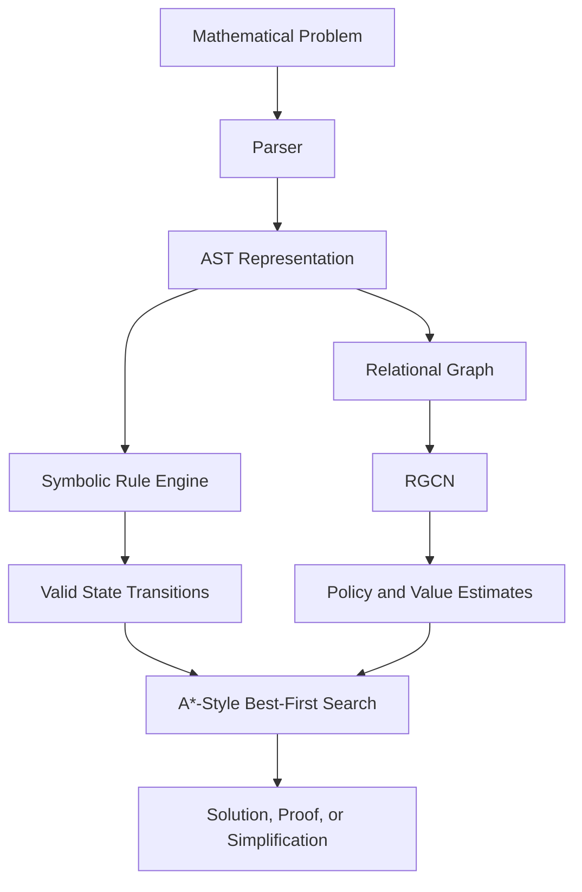

# Neural-Symbolic Math Solver

A research-oriented neural-symbolic mathematics solver that combines symbolic reasoning, relational graph neural networks, neural-guided best-first search, curriculum learning, and failure replay.

The project represents mathematical expressions as Abstract Syntax Trees (ASTs), applies symbolic transformation rules, and uses a Relational Graph Neural Network (R-GNN) to guide the search for valid solution paths.

The system is designed to explore problems involving algebra, equations, simplification, proofs, geometry, number theory, combinatorics, logic, and symbolic mathematical reasoning.

---

## Overview

Traditional symbolic solvers rely entirely on manually defined rules and search strategies. Purely neural approaches, on the other hand, can struggle with exact and structured mathematical reasoning.

This project combines both approaches:

- Symbolic rules generate mathematically structured transformations.
- Mathematical expressions are represented as Abstract Syntax Trees (ASTs).
- ASTs are converted into relational graphs.
- A Relational Graph Convolutional Network (RGCN) evaluates mathematical states.
- A neural policy estimates promising symbolic transformations.
- A value estimate is used as a heuristic for search.
- A best-first search algorithm prioritises promising states using an A*-style scoring mechanism.
- Curriculum learning gradually increases problem difficulty.
- A failure replay buffer allows difficult problems to be revisited.

The goal is to investigate whether neural guidance can make symbolic search more efficient and adaptive.

---

## Architecture



---

## Core Components

| Component | Description |
|---|---|
| AST System | Represents mathematical expressions structurally |
| Parser | Converts mathematical expressions into ASTs |
| Symbolic Rule Engine | Generates valid mathematical transformations |
| Graph Builder | Converts ASTs into relational graph representations |
| RGCN | Learns representations of mathematical states |
| Policy Head | Scores possible symbolic actions |
| Value Head | Estimates the quality of a mathematical state |
| Neural Search | Performs neural-guided best-first search |
| Curriculum Manager | Gradually increases problem difficulty |
| Failure Replay Buffer | Revisits difficult unsolved problems |
| Synthetic Generator | Creates training problems and trajectories |

---

# Symbolic Expression Representation

Mathematical expressions are represented using custom AST nodes.

The main node types include:

- `Num` — numerical values
- `Var` — mathematical variables
- `PatternVar` — wildcard variables used for symbolic pattern matching
- `Op` — mathematical operations
- `ProofState` — collections of active derived facts

This representation allows the solver to manipulate mathematical expressions structurally rather than treating mathematics as plain text.

---

# Mathematical Vocabulary

The solver supports a broad vocabulary of mathematical operations and concepts.

## Algebra

- Addition
- Subtraction
- Multiplication
- Division
- Powers
- Equations
- Factoring
- Polynomial transformations
- Quadratic equations

## Functions

- `sin`
- `cos`
- `tan`
- `log`
- `ln`
- `sqrt`
- `exp`
- `abs`

## Geometry

- Distance
- Circle area
- Triangle area
- Triangle angle relationships
- Parallel and perpendicular relationships
- Triangle congruence and similarity

## Number Theory

- Modulo
- GCD
- LCM
- Divisibility
- Prime-related predicates
- Congruences

## Logic and Sets

- AND
- OR
- Implication
- Negation
- Universal quantification
- Existential quantification
- Set membership

## Combinatorics

- Combinations
- Permutations
- Factorials
- Summations
- Products

---

# Symbolic Rule Engine

The solver uses symbolic transformation rules to generate transitions between mathematical states.

Examples of supported transformations include:

- Algebraic simplification
- Equation manipulation
- Variable isolation
- Distributive transformations
- Factoring identities
- Radical transformations
- Exponent laws
- Logarithmic transformations
- Quadratic formulas
- Trigonometric identities
- Geometry formulas
- Number theory rules
- Combinatorial identities

Many rules include guards that prevent invalid transformations, such as:

- Division by zero
- Invalid cancellation
- Unsafe logarithmic transformations
- Invalid square-root transformations
- Invalid exponent operations

Bidirectional rules can generate transformations in both directions, increasing the search space while allowing the solver to reason flexibly.

---

# Neural Graph Model

Mathematical expressions are converted into relational graphs before being processed by a Relational Graph Convolutional Network (RGCN).

The graph representation allows the model to use the structure of mathematical expressions rather than relying only on a flat sequence representation.

The neural model produces two main outputs:

## Policy

The policy estimates which symbolic transformations are promising from the current state.

These scores are used to prioritise possible transitions during search.

## Value

The value estimate evaluates how promising a mathematical state is.

This value can be used as a heuristic signal when ranking states in the search frontier.

---

# Neural-Guided A*-Style Search

The notebook implements a neural-guided best-first search algorithm.

The search maintains a priority queue of mathematical states and repeatedly expands the most promising candidate.

The search score combines:

- The accumulated path cost (`g`)
- A heuristic estimate (`h`) derived from the neural value prediction

Conceptually, this follows the A* principle:

```text
f(n) = g(n) + h(n)
```

where:

- `g(n)` represents the cost accumulated while reaching a state.
- `h(n)` represents an estimate of how promising the state is.
- `f(n)` determines the priority of the state in the search frontier.

The neural model provides guidance for the heuristic and for ranking symbolic actions.

The search process is:

1. Start from the initial mathematical expression or proof state.
2. Generate valid symbolic transitions.
3. Evaluate candidate states using the neural model.
4. Estimate their search priority.
5. Add promising states to the priority queue.
6. Expand the best candidate.
7. Continue until the target is reached or the search budget is exhausted.

This makes the search better described as **neural-guided best-first search with an A*-style scoring mechanism**, rather than Monte Carlo Tree Search.

---

# Task Modes

The solver supports several reasoning modes:

- `SOLVE`
- `PROVE`
- `SIMPLIFY`
- `AUTO`

In `AUTO` mode, the solver determines the task type based on the structure of the input.

---

# Curriculum Learning

Training begins with simpler problems and gradually increases their difficulty.

The curriculum manager controls the current problem depth and adjusts the difficulty according to solver performance.

This allows the system to learn progressively rather than being immediately exposed to highly complex search spaces.

---

# Failure Replay Buffer

The project includes a Failure Replay Buffer for difficult problems.

When the solver fails to solve a problem, the problem can be stored and revisited during later training.

The replay mechanism can allow:

- Failed problems to be sampled again.
- Difficult examples to receive additional training attempts.
- Search budgets to increase for more difficult curriculum levels.
- Exploration behaviour to change across retries.
- Repeatedly unsuccessful problems to eventually be removed from the buffer.

This allows the system to learn from difficult examples rather than simply discarding unsuccessful search attempts.

---

# Synthetic Problem Generation

The notebook generates synthetic mathematical problems for training.

Generated problems can include:

- Starting expressions
- Target expressions
- Symbolic transformations
- Synthetic solution trajectories

The generator is used to create structured training examples and can provide a fallback learning signal when neural search does not find a successful path.

This creates two possible training paths.

## Search Success

When the neural-guided search reaches the target, the model learns from the successful search trajectory.

## Synthetic Teacher Trajectory

When the search fails but a synthetic trajectory is available, the model can still learn from the generated symbolic steps.

This helps bootstrap learning before the neural search becomes sufficiently effective.

---

# Training

Training combines search-generated and synthetic trajectories.

A typical training cycle includes:

1. Generate or sample a mathematical problem.
2. Determine the task mode.
3. Run neural-guided best-first search.
4. Check whether the target was reached.
5. Train on the successful search trajectory when available.
6. Otherwise, train using a synthetic trajectory when available.
7. Store difficult failures in the replay buffer.
8. Update curriculum difficulty based on performance.

The training loop records statistics such as:

- Training loss
- Success rate
- Curriculum depth

---

# Installation

The notebook installs and uses the following main dependencies:

```bash
pip install torch
pip install torch-geometric
pip install transformers
pip install accelerate
pip install bitsandbytes
pip install matplotlib
```

GPU acceleration is recommended for neural training and for running large language models.

---

# Running the Notebook

Open:

```text
neural_symbolic_math_solver.ipynb
```

Run the notebook cells in order.

The notebook will:

1. Install the required dependencies.
2. Define the AST system.
3. Define the mathematical vocabulary.
4. Compile symbolic transformation rules.
5. Build graph representations.
6. Initialise the RGCN-based neural model.
7. Generate synthetic mathematical problems.
8. Run neural-guided best-first search.
9. Train using curriculum learning and failure replay.
10. Visualise training progress.
11. Save the trained model weights.

The trained weights are saved as:

```text
math_rgnn_weights.pth
```

---

# Current Limitations

This project is experimental and research-oriented.

Some important limitations include:

- The symbolic rule system depends heavily on the quality and coverage of manually defined rules.
- Bidirectional rules can significantly increase the search space.
- The neural value estimate is not necessarily an admissible A* heuristic, so the search should be considered A*-style rather than a classical optimal A* implementation.
- Search complexity can grow rapidly for difficult problems.
- Training performance depends heavily on the quality and diversity of generated problems.
- High training success does not necessarily imply generalisation to unseen mathematical problems.
- Some mathematical domains require additional rules and stronger mathematical verification.

---

# Future Improvements

Potential future directions include:

- Better heuristic calibration for search.
- More principled cost and heuristic functions.
- Improved duplicate-state detection.
- Transposition tables and search caching.
- More diverse synthetic problem generators.
- Stronger curriculum strategies.
- Better failure replay prioritisation.
- Formal verification of symbolic transformations.
- Automated rule discovery.
- Evaluation on standard mathematical reasoning benchmarks.
- Separation of the notebook into reusable Python modules.

---

# Suggested Repository Structure

As the project grows, the notebook could eventually be reorganised into:

```text
neural-symbolic-math-solver/
│
├── notebooks/
│   └── neural_symbolic_math_solver.ipynb
│
├── src/
│   ├── ast_nodes.py
│   ├── parser.py
│   ├── rules.py
│   ├── graph_builder.py
│   ├── model.py
│   ├── search.py
│   ├── generators.py
│   └── training.py
│
├── models/
│   └── math_rgnn_weights.pth
│
├── README.md
└── requirements.txt
```

---

# Project Goals

The main goals of this project are to explore:

- Neural-symbolic reasoning
- Graph neural networks for mathematical expressions
- Neural-guided symbolic search
- A*-style search with learned heuristics
- Automated equation solving
- Symbolic simplification
- Learning-guided proof search
- Curriculum learning for mathematical reasoning
- Adaptive search strategies for structured problem spaces

The project explores how symbolic rules and learned neural representations can work together to navigate mathematical reasoning spaces.

---

# Final Note

This project combines:

**Symbolic Rules + Graph Neural Networks + Learned Policy/Value Guidance + A*-Style Best-First Search**

The objective is not to replace symbolic mathematics with a neural network, but to use neural models to guide structured symbolic reasoning through large mathematical search spaces.

The result is an experimental neural-symbolic framework for exploring learned mathematical search and reasoning.